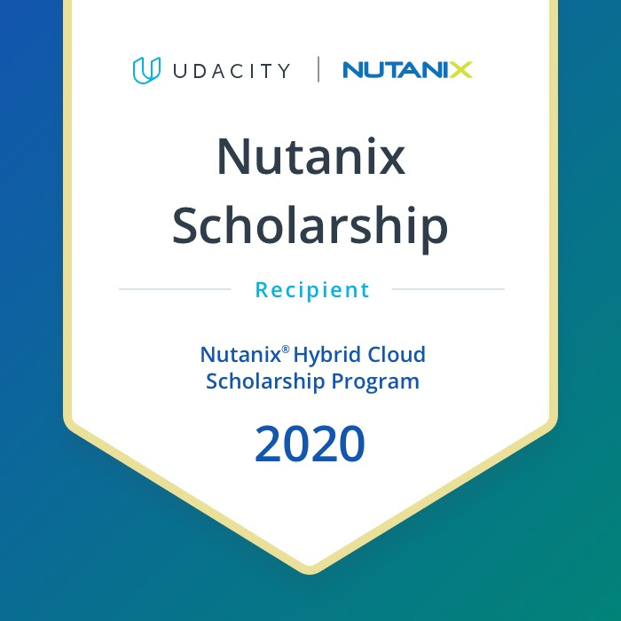

# Nutanix_50daysofudacity

### Hi LauraT here. Between July and October of 2020 I was accepted into phase 1 of the Nutanix Hybrid Cloud scholarship program. Here's a record of my daily coding/challenge during that time. The official challenge was 30 days but I did more than 50.  In October, I was awarded a full scholarship to learn hybrid cloud engineering and will earn a Hybrid Cloud Engineer Nanodegree (expected Jan 2021). Below is a badge of for those accepted into phase 2 of the scholarship.

7.8.20

#30days_udacity Day 1 

I pledged and went through unit 1-7 of Lesson Two. Some of the topics include digital transformation, understanding the cloud, and application design. I’d like to encourage @Raunak Sarada @Kapil C to keep up with their good work! 

7.9.20

#30days_udacity Day 2 :tada:

I completed part 8 to 12 of Lesson 2. Key topics include the 3-tier web application, cloud differentiator, and considerations when determining whether a business should use private or public cloud, or a mix of the two. I’d like to encourage @Anshu Trivedi and @Raunak Sarada to keep up their good work! :rainbow:

7.10.20

#30days_udacity Day 3 :tada:

I reviewed part 12 of Lesson 2 and moved on with 13-17, which covers cloud readiness, cloud smart (not first), and legacy IT (the mainframe). The part about the cloud policy of the US government is informative. I encourage @Oudarjya Sen Sarma and @THIYAGARAJAN to keep up with the good work! :muscle:

7.11.20

#30days_udacity Day 4 :tada:

:cherry_blossom: I reviewed part 17 and completed part 18-21 of Lesson 2. I learned about distributed computing, centralized storage (SAN and NAS) , and their respective advantages as well as disadvantages. :party_parrot:
:cherry_blossom: I participated in the first meeting and will take part in the 5-bullet Sunday to share articles or news about the cloud. :cloud: Thanks to @Mariia for a great first meeting! :sparkling_heart:
:cherry_blossom: I began the people counter project. :sonic:
:cherry_blossom: I also participated in two initiatives by @susyjam and shared pictures of my office and my neighborhood. :camera: :palm_tree:
:cherry_blossom: Encouraging the 5-bullet Sunday team @Raunak Sarada, @Melissa Bloomer, @Shankar Warang, @Sabyh - let’s chat soon! :dancing_penguin:
 

7.12.20

#30days_udacity Day 5 :tada:

:cherry_blossom: I reviewed part 21 (centralized storage) and completed part 22-29 of Lesson 2. Highlights include x86 virtualization, identifying hybrid cloud readiness, software defined datacenter, and the rise of public cloud. :cowboy-parrot:
:cherry_blossom: I continued to work on the people counter project. :sonic:
:cherry_blossom: I participated in the Sunday activity n #sg_spaic :dancing_penguin:
:cherry_blossom: Encouraging fellow scholars in the D.C. area @Paloma @J.D. Walker @Sean Brown to keep up their good work! :rocket:

7.13.20

#30days_udacity Day 6 :tada:

:cherry_blossom: I reviewed part 29 and completed part 30- 34 of Lesson 2. Main points include hyper converged infrastructure, SDDs and HCI. :female-technologist::skin-tone-2:
:cherry_blossom: It was such a long day and I almost didn’t couldn’t finish my challenge but so glad I made it through. It was a good feeling to prove to myself that I could do this.  :dancing_penguin::sparkling_heart:
:cherry_blossom: I encourage everyone to stay strong and keep moving along, no matter how hard it seems. :muscle::rocket::fire:

7.14.20

#30days_udacity Day 7 :tada:

:cherry_blossom: I reviewed part 34 and completed part 35-37 of Lesson 2. Topics of discussion include when to use or not use hybrid cloud; cloud smart examples, and analyzing business requirements regarding application portability, compliance and security, cost (TCO + ROI), scalability, resilience and availability, performance, manageability, and data protection and recoverability. :rainbow:
:cherry_blossom: I read about the difference between hybrid cloud and multi cloud: :party_parrot:https://www.nutanix.com/blog/hybrid-cloud-vs-multi-cloud-whats-difference
:cherry_blossom: I learned about hyperconverged infrastructure via Nutanix University :dancing_penguin:https://www.nutanixuniversity.com/learn/lp/5/Hyperconverged%252520Infrastructure
:cherry_blossom: I’d like to encourage everyone to keep up their good work! :fire::rocket:

7.15.20

#30days_udacity Day 8 :tada:

:cherry_blossom: I reviewed part 37 and completed the remaining parts of Lesson 2. 
:cherry_blossom: I read the wonderful advice offered by our Nutanix Technology Champion @Patrick Damen (NutanixNTC) :medal:https://nutanixcloudchallenge.slack.com/archives/C015DJJ4STV/p1594840946049200
:cherry_blossom: I read a helpful article “Understanding The Journey To True Hybrid Cloud” https://www.nutanix.com/blog/understanding-the-journey-to-true-hybrid-cloud (Thank you @Rothwulf for the recommendatiion! :thankyou:)
:cherry_blossom: I encourage everyone to keep up their good work and continue to learn! :fire::rocket:

7.16.20

#30days_udacity Day 9 :tada:

:cherry_blossom: I reviewed Lesson 2 and completed parts 1 to 4 of Lesson 3. Topics of discussion include the why and what of Nutanix HCI. :dancing_penguin:
:cherry_blossom: I read about the blockchain as a service: 
https://medium.com/quarkchain-official/quarkchain-and-amazon-web-service-reached-in-depth-technical-cooperation-and-launched-the-105c4b6c6e40 
(Thanks to @Shankar Warang for the recommendation! :thankyou:)
:cherry_blossom: Encouraging everyone to keep up your good work! :dancingpanda::blob-dance::meow_party:

7.17.20

#30days_udacity Day 10 :tada:

:cherry_blossom: I went through parts 1 to 4 of Lesson 3. :sonic:
:cherry_blossom: I read about what Nutanix offers to their clients: https://www.nutanix.com/what-we-do :cowboy-parrot:
:cherry_blossom: I learned about Nutanix Karbon: https://www.nutanix.com/viewer?type=pdf&path=/content/dam/nutanix/resources/solution-briefs/sb-karbon.pdf :rocket:
:cherry_blossom: Happy Friday everyone! Happy World Emojis Day! Happy Learning! :party_parrot::hamster_dance::mario_luigi_dance::meow_party::dancing_penguin:

7.18.20

#30days_udacity Day 11 :tada:

:cherry_blossom: I reviewed part 4 and and completed parts 5 to 9 of Lesson 3, learning about nodes, blocks, Acropolis, and Prism. :rocket:
:cherry_blossom: I participated in the sg_spaic seminar. :party_parrot:
:cherry_blossom: I worked with my wonderful teammates on the 5 bullet Sunday digest: https://nutanixcloudchallenge.slack.com/archives/C0167475DE2/p1595108756430400

7.19.20

#30days_udacity Day 12 :tada:

:cherry_blossom: I reviewed part 5-9 and and completed part 10 of Lesson 3. The focus is Prism. :rocket:
:cherry_blossom: I further learned about Nutanix Prism and Acropolis with this: https://www.youtube.com/watch?v=tGzcUL6RN6s :raised_hands:
:cherry_blossom: I watched a video explaining why Twitter hack incident might have happened: :eyes:https://www.youtube.com/watch?v=croxobxz1bU&feature=youtu.be
:cherry_blossom: Hope everyone has a productive week ahead! :bananadance::meow_party::dancing_penguin: 

7.20.20

#30days_udacity Day 13 :tada:

:cherry_blossom: I continued to learn about Acropolis and Prism in Lesson 3. :dancing_penguin:
:cherry_blossom: I always wondered about the differences between VMware and Nutanix and read a good article about that today: https://www.nutanix.com/info/nutanix-vs-vmware :blob-dance:
:cherry_blossom: I worked on a people counter project using Intel Openvino Toolkit. :party_parrot:
:cherry_blossom: Hope everyone’s week its off to a good start! :rocket::hamster_dance::boba-parrot:

7.21.20

#30days_udacity Day 14 :tada:

:cherry_blossom: I reviewed part 5-10 and and completed the exercise in part 11 of Lesson 3. I find the exercise helpful in navigating Prism. :party_parrot:
:cherry_blossom: I read about Erasure coding: https://www.dasher.com/what-is-erasure-coding/ (Thanks @Jaime Alejandro Parra Parra for the recommendation! :thankyou:)
:cherry_blossom: Encouraging everyone to keep up your good work! :muscle::fire:

7.22.20

#30days_udacity Day 15 :tada:

:cherry_blossom: I went through parts 12-15 of Lesson 3 with topics surrounding VM management, data protection, and operational insights. :bananadance:
:cherry_blossom: I worked with my 5-Bullet Sunday teammates and collected resources for this week’s newsletter. Shout out to @Melissa Bloomer @Raunak Sarada @Oudarjya Sen Sarma @Shankar Warang @Sabyh for being awesome!! :star2::100::rocket: I’m lucky to have the opportunity to work with you all.:coffee_parrot:
:cherry_blossom: I learned more about Nutanix hyper-converged infrastructure products here: https://searchconvergedinfrastructure.techtarget.com/feature/Get-to-know-Nutanix-hyper-converged-infrastructure-products-in-depth
:cherry_blossom: Happy Hump Day (Wednesday), everyone! :camel:

7.23.20

#30days_udacity Day 16 :tada:

:cherry_blossom: I completed Lesson 3 and began working on Lesson 4.
:cherry_blossom: I read about feature learning for machine learning. https://towardsdatascience.com/feature-engineering-for-machine-learning-3a5e293a5114?gi=325b667ba728 Thanks @melissa bloomer for the recommendation!
:cherry_blossom: I encourage everyone to keep up your good work! :rocket::ahhhhhhhhh:

7.24.20

#30days_udacity Day 17 :tada:

:cherry_blossom: I began Lesson 4 and began learning about cloud security standards. :lock_with_ink_pen:
:cherry_blossom: I participated in the Nutanix webinar today! :meow_party::bananadance::dancing_penguin:
:cherry_blossom: Happy Friday, everyone! :beach_with_umbrella::skypeparty::beach_with_umbrella::skypeparty::beach_with_umbrella::skypeparty:

7.25.20

#30days_udacity Day 18 :tada:

:cherry_blossom: I completed parts 2-4 of Lesson 4. Topics continue comparison of security for the pubic and private cloud, and the security development life cycle. :lock_with_ink_pen:
:cherry_blossom: I participated in the #sg_spaic webinar today and learned about features of Nutanix data protection and the latest development in SSD and HHD. A big thank you to @Mariia for organizing it and for @Mir Shahzad @Yash Bhamare for the great presentations! :thankyougreen::100::star-struck:
:cherry_blossom: Hope you’re all enjoying the weekend! :rainbow::beach_with_umbrella:

7.26.20

#30days_udacity Day 19 :tada:

:cherry_blossom: I continued to work on the units regarding security development life cycle.
:cherry_blossom: I updated my Github profile page. Still working on it but hoping to participate in the #sg_spaic challenge hosted by @DSTsme (Thank you for organizing it!)
:cherry_blossom: Hope you’ll have a productive week ahead. Happy learning! :highfive::hamster_dance::dancing_penguin::party_parrot::dance_4:

7.27.20

#30days_udacity Day 20 :tada:

:cherry_blossom: Today I focused the implementation, test, and update stage of the security development life cycle and how Nutanix integrates security into every step of their product development. :dancing_penguin:
:cherry_blossom: I read From Zero to Hyperconverged in 90 Days: https://upshotstories.com/stories/from-zero-to-hyperconverged-in-90-days :star2::rocket: Thanks @Shahnawaz Ahmed for the recommendation! :thankyougreen:
:cherry_blossom: Hope everyone’s week is off to a good start! :fire::coffee_parrot::sonic:

7.28.20

#30days_udacity Day 21 :tada:

:cherry_blossom: Today I learned about two-factor authentication, cluster lockdown, as well as key management and administration. :party_parrot::unlock::partly_sunny:
:cherry_blossom: I learned more about crypto erase: 
https://blog.seagate.com/business/what-makes-crypto-erase-so-popular-nist-and-iso-endorse-simplest-secure-erase-solution/ :fire:
:cherry_blossom: Hope everyone is doing well and keep learning!! :dancing_penguin::skypeparty::blob-wave::sonic::coffee_parrot:

7.29.20

#30days_udacity Day 22 :tada:

:cherry_blossom: Today I learned about security technical implementation guides, data-at-rest encryption, role-based access control, and thus concluded Lesson 4. :party_parrot:
:cherry_blossom: I learned about Nutanix Flow: :rainbow:
https://searchconvergedinfrastructure.techtarget.com/tip/An-introduction-to-Nutanix-Flow-software-defined-networking-for-HCI
:cherry_blossom: Happy Wednesday everyone! :hamster_dance::tea::woman-running::skin-tone-2:

7.30.20

#30days_udacity Day 23 :tada:

:cherry_blossom: I began Lesson 5 and began learning about networking.  :dancing_penguin:
:cherry_blossom: I signed up for the Nutanix bootcamp and am really looking forward to it!! :fire:
:cherry_blossom: I began the test drive of Nutanix Hyperconverged Infrastructure https://www.nutanix.com/one-platform?adobe_mc_sdid=SDID%3D43F624086A87433C-575755A336C5BFBE%7CMCORGID%3D21CB300E5B1536270A495D34%40AdobeOrg%7CTS%3D1596170893&utm_source=Virtual%2520Bootcamps&utm_medium=slide&utm_campaign=vtb_testdrive Thank @jdcorder for the post in #ask_nutanix_ntc! :thankyougreen:
:cherry_blossom: Happy learning, everyone!! :sonic::mario_luigi_dance::cowboy-parrot:

7.31.20

#30days_udacity Day 24 :tada:

:cherry_blossom: I learned about physical networking and core-aggregation-access today. :party_parrot:
:cherry_blossom: I read the articles from the current issue of 5-Bullet Sunday: :rocket:https://nutanixcloudchallenge.slack.com/archives/C0167475DE2/p1595695572075900 For those of you who don’t know, @Melissa Bloomer @Oudarjya Sen Sarma @Raunak Sarada @Sabyh and I curate this for the community every week.  Be sure to check out #sg_spaic for past issues if you haven’t already. :dancing_penguin: New issue is out every Sunday! :blob-sunglasses:
:cherry_blossom: Happy Friday everyone! :cowboy-parrot::mario_luigi_dance::skypeparty:

8.1.20

#30days_udacity Day 25 :tada:

:cherry_blossom: I completed the unit about physical network topology, including 3-tier and leaf-spine. I also cleaned about virtual networking, including switches, bridges, ports, and bonds. I learned about VLAN, and completed the exercise for creating an unmanaged network in Prism. :fire::rocket:
:cherry_blossom: I participated in the #spaic webinar and learned about blockchain and quantum computing. It was great to see you all :star-struck: @Mariia@susyjam@Abhik Banerjee @Anantharam Vemuri @DSdatsme @Kapil C @Oudarjya Sen Sarma @Raunak Sarada @Remi @Sabyh @Shankar Warang  @Vishal Ambavade @Vincent Battaglia (I hope I didn’t miss anyone! ):dancing_penguin::party_parrot::meow_party:
:cherry_blossom: Happy August everyone! :palm_tree::beach_with_umbrella::blob-sun:

8.2.20

#30days_udacity Day 26 :tada:

:cherry_blossom: I went through the remaining of Lesson 5 and learned about managed networks and completed the exercises. I began Lesson 6 and learned about types of virtual machines.  
:cherry_blossom: I read about TensorFlow Quantum: https://www.myreadersspace.com/2020/07/understanding-quantum-ml-using.html
:cherry_blossom: Have a great week, everyone! :rainbow::hamster_dance::dancing_penguin:

8.3.20

#30days_udacity Day 27 :tada:

:cherry_blossom: I continued with Lesson 6 and learned about the VM dashboard, creating and updating a VM as well as working with images. I’ve also completed their respective exercises. :sonic:
:cherry_blossom: I worked on initiatives for #celebrate. :cowboy-parrot:  Check out who won the weekly quiz and see who has completed the courses in #celebrate! :tada::tada::tada::tada:
:cherry_blossom: https://devops.com/3-key-issues-with-hybrid-cloud-transformation/ Thanks @Melissa Bloomer for the recommendation! :thankyougreen:
:cherry_blossom: Happy Monday, everyone! :fire::rocket:

8.4.20

#30days_udacity Day 28 :tada:

:cherry_blossom: I learned about cloning, deleting, migrating a VM, enabling VM HA, and thus concluded Lesson 6 :sonic:
:cherry_blossom: I read about digital transformation. https://www.techrepublic.com/article/idc-digital-transformation-spending-will-eat-up-50-of-it-budgets-by-2023/ Thank you @Ashish Karn for the recommendation! :thankyougreen:
:cherry_blossom: Happy learning, everyone! :party_parrot::mario_luigi_dance::arthur_dance::bananadance:

8.5.20

#30days_udacity Day 29 :tada:

:cherry_blossom: I went through a big chunk of Lesson 7 today. Topics of discussions include disaster recovery, challenges and trends of data protection, RTO and RPO, infrastructure resistance (turnable redundancy, erasure coding, integrity checks, availability domains, and backups. :rocket:
:cherry_blossom: I learned more about data recovery here: https://www.nutanix.com/blog/data-protection-and-disaster-recovery-checklist
:cherry_blossom: Happy Hump Day! :camel::cowboy-parrot::mario_luigi_dance::dancing_penguin:

8.6.20

#30days_udacity Day 30 :tada:

:cherry_blossom: I completed the exercise of creating protection domains/Local VM restore. I also went through units about converged local backup, integrated remote backup, cloud backups, and thus completed the foundations course.:) 
:cherry_blossom: I’d like to encourage everyone to keep going even if you already completed the course!! Stop by #celebrate and cheer for yourself and your peers! Let’s #celebrate!  

8.13.20

#30days_udacity Day 30+ :tada:

After Day 30 I took a little break for posting, but wanted to check in to see how everyone’s doing! :bananadance:Last week I began reviewing the course and participated in the #spaic weekly meeting on Saturday. :party_parrot: I also began digging into the wonderful resources that #nutanix_certification has to offer. :star2: Today I participated in the Nutanix Bootcamp, which I highly recommend. If you are interested you can register for the Aug. 18 session here: :point_right: https://www.nutanix.com/virtual 

Last but not least, a big thank you to many of you who have encouraged and inspired me :sparkling_heart: @Frida@susyjam @Lara Freiria @Nigel P @Edgardo Peregrino@Pradeep Ash@Ankur Shishodia @Vincent Battaglia @RobG @Sean Brown@Ankita Ghosh @Amardeep Singh @Mohamed Fazal Mustafa @Christian Rivera @Chris M @Shivani@lalit.vc@Ashish Karn@Anshu Trivedi@Jaime Alejandro Parra Parra @Sahil Wasan@AndyP@ironBot @Melissa Bloomer @Oudarjya Sen Sarma @Melissa Bloomer @Sabyh @Raunak Sarada @Shankar Warang - Keep up your great work, to the Cloud!!  :rocket::rainbow::sun_small_cloud:

8.15.20

#30days_udacity Day 31 :tada:

All right! This is a bit hard to explain but I have to admit I miss you all in #30days_udacity and I’m coming back!! :hugging_face:
:cherry_blossom: Today I participated in #sg_spaic seminar and learned about Raspberry Pi and the cloud. Thank you @Edgardo Peregrino for the great presentation! :thankyougreen:
:cherry_blossom: I went through the beginning of Enterprise Cloud for Dummies, which is part of the study materials from the awesome @RobG and his #nutanix_certification :rocket:
:cherry_blossom: I participated in a seminar and learned about spaCy. :raised_hands:
:cherry_blossom: I learned about feature engineering and forecasting using Azure machine learning studio. :sonic:
:cherry_blossom: Inspired by @susyjam’s and @Edgardo Peregrino’s daily music, here’s one dedicated to you all in #30days_udacity https://www.youtube.com/watch?v=xXFdnHiGwos :headphones:
:cherry_blossom: Encouraging @Lara Freiria @Frida @susyjam @Mariia @Mary Becken@Chris M  @Sean Brown @Edgardo Peregrino @Nigel P @RobG @Sabyh @Oudarjya Sen Sarma

8,.16.20

#30days_udacity Day 32 :tada:

:cherry_blossom: I’m so glad I got to participate in the chat with @RobG @Nigel P @DSdatsme today during #tech_help - It was a great experience and I am now motivated to prepare for the Nutanix certification exam with you all! :party_parrot: @Grace.Udacity: @Rob would be a great candidate for our next AMA.  He has a lot of knowledge in this field and is doing a great job with #nutanix_certification. He is also a lot of fun to talk to if you haven’t noticed!:mario_luigi_dance: I wonder if it’s possible that the AMA is in the format of a Zoom meeting. I’ll be happy to help with the set up if you need help! :raised_hands:
:cherry_blossom: I completed the Enterprise Cloud for Dummies book. It was a very quick skim through but I now have a much better understanding of the enterprise cloud (and Nutanix!). :arthur_dance:
:cherry_blossom: I looked into the NCP exam rules: https://www.nutanixuniversity.com/learn/course/225/ncp-mci-515-exam :bananadance:
:cherry_blossom: I enrolled in the NCP course. Going through Module 1 right now. :rocket:
:cherry_blossom: I read through (again, very quickly) the Definitive Guide to Hyperconverged Infrastructure. :sonic:  
:cherry_blossom: I learned about open source, anomaly detection, and managed services in Azure. :dancing_penguin:
:cherry_blossom: Music today: Coffee for Your Head (which I need :coffee:) https://www.youtube.com/watch?v=jJPMnTXl63E 
:cherry_blossom: Encouraging @Frida @EO4Wellness @AudreyST @Edgardo Peregrino @Oudarjya Sen Sarma @Anshu Trivedi @Ankur Shishodia @Sahil Wasan @Max Deng @Ashish Karn @Sandipan Saha @Amardeep Singh @Alex  - hope your week is off to a good start! :rainbow:

8.17.20

#30days_udacity Day 33 :tada:

:cherry_blossom: I began reviewing the foundations course ( Lesson 1 and Lesson 2), double checking and making sure that I’ve completed all quizzes. :meow_party:
:cherry_blossom: I read the notes about benefits of Nutanix HCI shared by @Swapnil Gaikwad (Great work! Thank you! :thankyougreen:): https://nutanixcloudchallenge.slack.com/archives/C015V9WC4V9/p1597488549020200 
:cherry_blossom: I also read about benefits of the hybrid cloud https://www.quora.com/Why-are-hybrid-clouds-so-important?share=1 (Thanks again to @Swapnil Gaikwad! :thankyougreen:)
:cherry_blossom: I learned about managed services in Azure. :microsoft:
:cherry_blossom: I worked on Intel project 2. More to go tomorrow. :workworkwork: 
:cherry_blossom: Encouraging everyone in this channel with a motivational quote from Stephen Hawking that I learned from an amazing friend: 
However difficult life may seem, there is always something you can do and succeed at. :rainbow:

8.18.20

#30days_udacity Day 34 :tada:

:cherry_blossom: I continued to review Lesson 2. I have a much better understanding about the course the 2nd time around. :pandadance:
:cherry_blossom: I registered for .NEXT digital conference. Thanks for letting me know about this @Sean Brown https://www.nutanix.com/next :thankyougreen:
:cherry_blossom: I continued to work on the smart queueing system project. :female-construction-worker::skin-tone-2:
:cherry_blossom: I went through lessons about responsible AI and read several articles about it. Responsible AI is a topic near and dear to my heart and I hope to explore further in regards to this topic. :rainbow:
:cherry_blossom: I worked on activities for the upcoming Study Jam with @Sabyh - We’re going to have a fun Study Jam! :mario_luigi_dance:
:cherry_blossom: Hope everyone is happy and well! :party_parrot: https://www.youtube.com/watch?v=y6Sxv-sUYtM

8.19.20

#30days_udacity Day 35 :tada:

:cherry_blossom: I continued to review Lesson 2 today. :female-construction-worker::skin-tone-2:
:cherry_blossom: I began compiling study materials for NCP and I began Lesson 1 of ECP 5.15. I looked at the quizzes @RobG compiled. It helped me with finding the focus of the course materials. Thank you @RobG! :thankyougreen:
:cherry_blossom: I read the state of dev ops report provided by the course again. The stats about the 5 essential characteristics of cloud computing on page 35 are worth noting: https://services.google.com/fh/files/misc/state-of-devops-2019.pdf
:cherry_blossom: I then came across another dev ops report and went through it: https://nutanixcloudchallenge.slack.com/archives/C016CEFL7K7/p1597173199107000
(Thank you @Saurav Raghuvanshi for sharing! :thankyougreen:)
:cherry_blossom: I went a bit overboard and found another state of the dev ops article:
https://www.baytechconsulting.com/state-of-devops/#:~:text=The%20rise%20of%20DevOps%20as,cloud%20computing%20and%20organizational%20structures. :party_parrot: All in all, each one has a different focus and it was nice to read them all. :pandadance:
:cherry_blossom: I completed the Azure foundations course. :skypeparty:
:cherry_blossom: I created a Bingo game along with @Sabyh today. It was lots of :point_right:  :rolling_on_the_floor_laughing:
:cherry_blossom: I celebrated the photography day in #celebrate. :camera_with_flash:
:cherry_blossom: Encouraging everyone to continue to make progress! :rocket::rainbow:

8.20.20

#30days_udacity Day 36 :tada:

:cherry_blossom: I reviewed the concept of hyperconverged infrastructure with this guide book: https://www.nutanix.com/viewer?type=pdf&lpurl=what-is-nutanix-hyperconverged-infrastructure.html&fromCampaign=true :dancing_penguin:
:cherry_blossom: I learned about cloud computing from @Swapnil Gaikwad :thankyougreen:: https://www.guru99.com/cloud-computing-for-beginners.html :pandadance:
:cherry_blossom: I worked on the Bingo card for the study jam. :bananadance:
:cherry_blossom: I continue to debug the smart queueing system project. :exploding_head:
:cherry_blossom: Encourage everyone is doing well! :rainbow:

8.21.20

#30days_udacity Day 37 :tada:

:cherry_blossom: I reviewed the parts in Lesson 2 about Legacy IT. :female-construction-worker::skin-tone-2:
:cherry_blossom: I participated in the tech AMA with @Donna.L (Thanks for a great session, Donna! :sparkling_heart:)
:cherry_blossom: I did the final prep for the Study Jam - looking forward to seeing you all tomorrow! :party_parrot:
:cherry_blossom: I reviewed the Azure course. :raised_hands:
:cherry_blossom: I spent a lot of time on the smart queueing system project and finally completed the part about the manufacturing sector. Happy to see the light after several days of work, which makes me think of “Only in my darkest moments can I see the light” in This December: https://www.youtube.com/watch?v=gzxk4KepBOc :guitar:
:cherry_blossom:  Encouraging several buddies here @Frida @Lara Freiria @EO4Wellness @susyjam@Alex @Nigel P @George Nyandika @Edgardo Peregrino Happy Friday! :rainbow:

8.22.20

#30days_udacity Day 38 :tada:

:cherry_blossom: I participated in as many activities as possible today. I participated in the ice breaker game (thank you @AudreyST@Selvi :thankyougreen:), several tech and non-tech quizzes (thank you @Raj Pathare@Rashmi Nagpal@Tali @Kapil C:thankyougreen:), meme challenge (thank you @Oudarjya Sen Sarma:thankyougreen:), games (thank you @ironBot:thankyougreen:) and several wonderful webinars (Thank you @Shivani @Domingo Perez @RobG @Edgardo Peregrino:thankyougreen:) The Study Jame wouldn’t have been possible without you all! :sparkling_heart:

For those of you who just woke up, I encourage you to keep going! :sonic: There’s still plenty of time to hit Bingo for you all.  Enjoy the rest of the Study Jam! :tram::tada:https://nutanixcloudchallenge.slack.com/archives/C015DJJ4STV/p1598113007040800

8.23.20

#30days_udacity Day 39 :tada:

:cherry_blossom: Today I reviewed and organized notes from the seminars during the study jam. I also went through the week 1 study guide by @RobG. :thankyougreen:
:cherry_blossom: I worked on the 5 Bullet Sunday for #sg_spaic. :pandadance:https://nutanixcloudchallenge.slack.com/archives/C0167475DE2/p1598222393043800
:cherry_blossom: Well said @Sean Brown. Wash, rinse, repeat. :100::muscle: Have a good week ahead, everyone! :rocket:

8.24.20

#30days_udacity Day 40 :tada:

:cherry_blossom: I finally got to watch the recording from Week 1 of the NCP study group. Well done @RobG! :thankyougreen: I find it easier to follow your study guide than to go through the Nutanix University jungle.:100: I think moving forward I’ll go through your materials before I go on NutanixU. :smile: 
:cherry_blossom: I began learning about ROBO Deployment and operations which is part of the materials in the Section 2 of the Exam Blueprint. ROBO is new to me but I’m learning. :muscle:
:cherry_blossom: I attended the AMA today. :sparkling_heart:
:cherry_blossom: Encouraging a few friends here @Odaliz @Tali @Peter @EO4Wellness @Leo Hideki  @Jitesh @THIYAGARAJAN (I try not to tag the same friends every day but you know thinking of all of you! :dancing_penguin:)

8.25.20

#30days_udacity Day 41 :tada:

:cherry_blossom: I reviewed Lesson 2.16-2.34 - topics include legacy IT, public cloud, and HCI. :meow_party:
:cherry_blossom: I probably googled too much about HCI and VMware found me so I ended up reading about their version of HCI. I haven’t yet had a chance to compare it with Nutanix’s. :party_parrot:
:cherry_blossom: I began the week 2 recording of the #nutanix_certification study group. :hamster_dance:
:cherry_blossom: I tried to schedule the NCP exam but encountered some difficulties. I sent an email to contact the support to see what’s going on. :blob-dance:
:cherry_blossom: I’m learning how to define and differentiate features and technologies present in Acropolis, Prism and Calm: :pandadance:
 https://www.virtualramblings.com/define-and-differentiate-features-and-technologies-present-in-acropolis-prism-and-calm/ 
:cherry_blossom: Hope everyone is doing well! :rainbow::star:

8.26.20

#30days_udacity Day 42 :tada:

:cherry_blossom: I continued to go through the study guide and the week 2 recording of the #nutanix_certification study group.  You don’t know this @RobG @Nigel P but you are the two I see the most from the Nutanix scholarship these days (from the vids :smile:) Thank you so much @RobG for recording the sessions so those of us have a chance to catch up. :thankyougreen:
:cherry_blossom: I did a few lab exercises in the Jupyter notebook for Azure. :raised_hands:
:cherry_blossom: Sending positive vibes to @Frida @susyjam @EO4Wellness @AudreyST@Tali @Chris M @Lara Freiria @Odaliz @RobG @Sean Brown @Nigel P @THIYAGARAJAN @Edgardo Peregrino @Alex @Christian Rivera @Leo Hideki @Nícolas Pauli @Amardeep Singh @Jitesh @Kapil C @Muhammad Haris @Harkirat Singh - Thank you all for inspiring me every day. I’m staying motivated here to learn more because of you. :thankyougreen::rocket::rainbow:

8.27.20

#30days_udacity Day 43 :tada:

:cherry_blossom: It was a super busy day. I was happy that I decided to complete the week 2 recording from #nutanix_certification. :raised_hands:
:cherry_blossom: I read an interesting article about pre-trained BERT for Targeted Aspect-Based Sentiment Analysis: https://towardsdatascience.com/day-103-nlp-research-papers-utilizing-bert-for-aspect-based-sentiment-analysis-via-constructing-38ab3e1630a3 :cowboy-parrot:
:cherry_blossom: Encouraging @Jhonatan Nagasako - almost Day 30!! You are doing great!! :rocket::tada:

8.28.20

#30days_udacity Day 44 :tada:

:cherry_blossom: I began week 3 of the study group recording from the #nutanix_certification. Thank you @RobG for keeping me going! :cowboy-parrot:
:cherry_blossom: I began going through the Nutanix Bible: https://nutanixbible.com/. I went through the section about the evolution of the datacenter, including the era of the mainframe, stand-alone servers, centralized storage and centralized storage.
:cherry_blossom: Happy Friday, everyone! :skypeparty::beach_with_umbrella::palm_tree:

8.29.20

#30days_udacity Day 45 :tada:

:cherry_blossom: I continue to go through study group recording from the #nutanix_certification.
:cherry_blossom: I continued to go through the Nutanix Bible.
:cherry_blossom: I participated in the #sg_spaic meeting today and learned about network programming. Thanks @Muhammad Haris for the informative session! :thankyougreen:
:cherry_blossom: Hope you are all enjoying the weekend! :rainbow::hamster_dance:

8.30.20

#30days_udacity Day 46 :tada:

:cherry_blossom: I went through the NCP Blueprint Guide to learn more about the basics of NCP https://nuschool.portal.relayware.com/content/EDUCollateral/NCP5.5-EBG-5.21.2019.pdf
:cherry_blossom: I checked in #tech_help. A big thank you to @RobG for being there to help us during the office hours! :thankyougreen:
:cherry_blossom: This week’s 5 Bullet Sunday is about Elon Musk’s brain-machine interface. If it comes true, it’ll change the human life forever as we know it and it’ll introduce a wide range of issues that we should probably start thinking about now. I’m curious what you all think about this. I haven’t watched the demo yet but would like to do so soon: :brain:https://nutanixcloudchallenge.slack.com/archives/C0167475DE2/p1598776519087900
:cherry_blossom: Have a great week ahead, everyone! :blob_cheer:

8.31.20

#30days_udacity Day 47 :tada:

:cherry_blossom: I started going through the unofficial Nutanix study guide: https://www.virtualramblings.com/unofficial-nutanix-ncp-study-guide/ I’m just starting but so far it’s been helpful. :dancing_penguin:
:cherry_blossom: I also read about common data science packages here: https://towardsdatascience.com/which-python-data-science-package-should-i-use-when-e98c701364c :hamster_dance:
:cherry_blossom: and an article about the road map to Kaggle Top 20 https://medium.com/@guyandtheworld/from-learning-python-to-becoming-kaggle-kernels-top-20-a-road-map-270d4c67d61e :meow_party:
:cherry_blossom: Hope you are all having a great start of the week! :blob_cheer:

9.1.20
#30days_udacity Day 48 :tada:

:cherry_blossom: Today I organized the resources from the awesome #nutanix_certification and try to catch up with the threads. I’ll plan to catch up with the weekly quizzes little by little. :dancing_penguin:
:cherry_blossom: I went through this helpful video about public cloud https://www.youtube.com/watch?v=KaCyfQ7luVY&list=PLOspHqNVtKAC-_ZAGresP-i0okHe5FjcJ Thank you @Anshu Trivedi for the recommendation! :thankyougreen:
:cherry_blossom: A big thank you to @E.O. for being an inspiration for me and the scholarship program.  I’m so happy to have the opportunity to learn alongside you! Thanks for being awesome! :100::sparkling_heart:

9.2.20
#30days_udacity Day 49 :tada:

:cherry_blossom: Today I completed the week-3 recording for the #nutanix_certification group from @RobG (thanks as always! :thankyougreen:) - There’s a lot of content covered and I’ll need to review this again. :rocket:
:cherry_blossom: The topic of responsible AI has been on my mind.  I read about the four fundamental principles proposed by the National Institute of Standards and Technology (NIST) by which we can judge how explainable AI’s decisions are. https://www.nist.gov/news-events/news/2020/08/nist-asks-ai-explain-itself :gosia:
:cherry_blossom: We’re half way there - Happy Hump Day! :camel::sonic::pandadance::coffee_parrot:

9.3.20

#30days_udacity Day 50 :tada:

:cherry_blossom: Not sure what I haven’t encountered this before but today I finally I watched this video about Nutanix https://www.youtube.com/watch?v=IKdzcwMY950&feature=youtu.be :nutanix2:
:cherry_blossom: I read an important article about a deep fake detector launched by Microsoft, which is crucial before the election: https://techcrunch.com/2020/09/02/microsoft-launches-a-deepfake-detector-tool-ahead-of-us-election/ :muscle: 
:cherry_blossom: I encourage you all to spot deepfakes here: https://www.spotdeepfakes.org/en-US :raised_hands:
:cherry_blossom: Happy learning, everyone! :hamster_dance:

9.4.20

#30days_udacity Day 51 :tada:

:cherry_blossom: I printed out the NCP 5.15 study guide and went through it again. I found it more helpful in getting the materials into my head when I read them in print. :hamster_dance:
:cherry_blossom: I completed the deep fake exercise today. I couldn’t spot all of them the first time. It took a bit of the practice. :eyes:
:cherry_blossom: I participated in the student leader meeting today. :raised_hands:
:cherry_blossom: Have a good weekend, everyone! For those in the US, have a good Labor Day weekend!  :fallen_leaf::hotdog::beer:

9.5.20

#30days_udacity Day 52 :tada:

:cherry_blossom: I participated in the #sg_spaic webinar today, learning about threat modeling from @Mariia and redeeming google vouchers from @Sabyh. Thank you both for a very informative session! :100::thankyougreen:
:cherry_blossom: I am working on the smart queuing system again, hoping to wrap it up tonight. :female-construction-worker::skin-tone-2:
:cherry_blossom: Hope you are enjoying the weekend! :pandadance::hamster_dance::party_parrot::meow_party::happy_kirb:

9.6.20

#30days_udacity Day 53 :tada:

:cherry_blossom: I went to the #tech_help office hours and chatted with the awesome @RobG regarding the updated NCP content, quizzes, and Linux. A big shout out to @RobG for hosting this during the 3-day Labor Day weekend! :thankyougreen: I admire your work ethic! :100:
:cherry_blossom: I submitted my smart queuing system project and now I’m now working on the people counter project. Hoping to wrap it up today. :rocket:
:cherry_blossom: Hope you are enjoying the long weekend! :rainbow:

9.7.20

#30days_udacity Day 54 :tada:

:cherry_blossom: So, I went back to lessons again! I reviewed Lesson 1 and Lesson 2.1-2.3, and went through the job functions of a hybrid cloud engineer. It is nice to review as I now have a deeper understanding of the course as compared to the first time around. :hamster_dance:
:cherry_blossom: I read the remote playbook by GitLab. https://about.gitlab.com/resources/ebook-remote-playbook/ Thank you @Jaime Alejandro Parra Parra for the recommendation! :thankyougreen:
:cherry_blossom: I continued to work on the people counter app. This is my 7th or 8th iteration of this project… :hyper:
:cherry_blossom: Hope you all have a great start of the week! :rainbow:

9.8.20

#30days_udacity Day 55 :tada:
:cherry_blossom: I participated in .NEXT and listened to the keynote. I was especially impressed by Secretary Condoleezza Rice’s discussion about the future of higher education. :coffee_parrot:
:cherry_blossom: My people counter app finally worked and I can’t say how happy I am! :grin: Also my smart queuing system project was approved so I have only one last project to go. Almost there! :muscle:
:cherry_blossom: I worked with the awesome 5-Bullet Sunday team to figure out a plan B with this week’s issue.  A big shout out to teammates @Oudarjya Sen Sarma @Raunak Sarada @Melissa Bloomer @Shankar Warang @Sabyh for everyone’s great work and commitment! :sparkling_heart:
:cherry_blossom: Happy learning, everyone! :dancing_penguin::hamster_dance::pandadance::mario_luigi_dance:

9.9.20

#30days_udacity Day 56 :tada:

:cherry_blossom: I attended the .Next Conference Day 2, joined the Day 2 keynote and checked out a few sponsors’ virtual booths. It was really well organized and I’m enjoying it! :party_parrot:
:cherry_blossom: @RobG You’ll be proud - I scheduled my NCP exam today for Dec. 10.  :+1: 
:cherry_blossom: I’m working now working on the final project - a computer pointer app that uses gaze detection and face or head movement to control curser. I’m having problems setting up the proper environment but I think I’ll be able to resolve it. :muscle:
:cherry_blossom: Happy Hump Day!! We are half way there! :smile::dromedary_camel::blob-dance:

9.10.20

#30days_udacity Day 57 :tada:

:cherry_blossom: I was bumped to have missed the Nutanix AMA today due to an emergency but was able to attend a session of the .Next conference: Designing for the Subscription Economy. I have a better understanding of the Nutanix service provider platform. :nutanix2:
:cherry_blossom: I continue to work on the pointer controller project. I’ll be spending time on this for the rest of the night. :typingcat:
:cherry_blossom: Hope you are all doing well! Stay Udacious! :udacity:

9.11.20

#30days_udacity Day 58 :tada:

:cherry_blossom: I’m really loving that I get to look at the on-demand library of the .Next virtual conference even conference has already ended. Today I learned about Nvidia Mellanox SN2010 and how it works with Nutanix Prism. I love it that the tutorial shows how all the cables and wires are connected. :female-construction-worker::skin-tone-2:
:cherry_blossom: I completed Day 2 of the Azure training today. Topics of discussion include Azure policies (control how users use Azure), compliance, governance, security, access control, identity protection, pricing, and support. 
:cherry_blossom: In remembrance of 9/11, I found strength in turning this tragic day into a day of doing good: https://911day.org/ :rainbow:
:cherry_blossom: Have a good weekend, everyone! :party_parrot::meow_party::hamster_dance::dancing_penguin::pandadance:

9.12.20

#30days_udacity Day 59 :tada:

:cherry_blossom: I watched the presentation about launching a REST API on an AWS EC2 instance by @Jorge Luis Rodríguez González for the #sg_latm. :thankyougreen: Thank you @susyjam for sharing the recording! :sparkling_heart:
:cherry_blossom: I participated in the #sg_spaic meeting. Thanks to @Mariia for a great presentation about email management. Much needed. I think I’ll spend sometime tomorrow to clean out my inbox. Congratulations to @Edgardo Peregrino for a successful launch of his voice controlled robot. It was exciting to see the bot in action! :robot_face:
:cherry_blossom: Hope you are enjoying the weekend! :skypeparty::skyperainbow:


9.13.20

#30days_udacity Day 60 :tada:

[Thing came up last night so I had to wait till morning ET to post this but this was done yesterday.]
:cherry_blossom: I watched the recording of the AMA by Cees Eijk, Mark Lavi, and Mark Brunstad. It was indeed very helpful! :party_parrot:
:cherry_blossom: I worked with our awesome 5-Bullet Sunday team and went through our Mega Issue. I definitely recommend it if you haven’t read it. :mario_luigi_dance:https://nutanixcloudchallenge.slack.com/archives/C0167475DE2/p1600030757233400
:cherry_blossom: Hope your week is off to a good start! :rocket:

9.14.20

#30days_udacity Day 61 :tada:

:cherry_blossom: I reviewed the unit about digital transformation and the cloud. I also reviewed concepts about service models. :dancing_penguin:
:cherry_blossom: I learned an about several useful chatbots: https://www.userlike.com/en/blog/chat-bots-entrepreneurs :robot_face:
:cherry_blossom: I read about resources for further training in cloud computing: https://digitaldefynd.com/best-google-cloud-course-training-certification/ :raised_hands:
:cherry_blossom: Hope you are having a great start of the week!! :rainbow:
